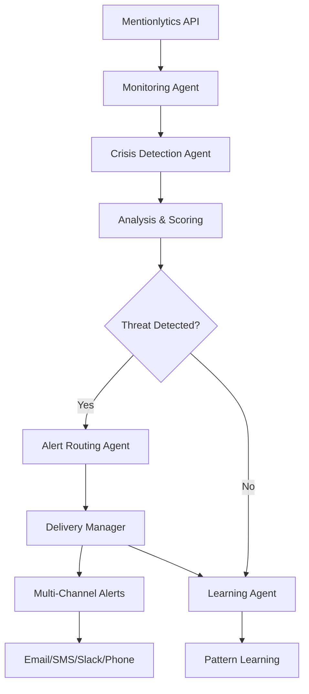

# Crisis Detection Workflow

**Intelligent real-time crisis detection and response system for political campaigns using LangChain and AI agents.**

## 🚨 Overview

The Crisis Detection Workflow provides comprehensive monitoring and automated response capabilities for political campaigns, detecting potential crises from social media mentions and news sources, analyzing their severity, and routing alerts to appropriate team members.

### Key Features

- **🤖 AI-Powered Analysis**: Uses GPT-4 for intelligent crisis severity assessment
- **📡 Real-Time Monitoring**: Integrates with Mentionlytics API for live mention tracking
- **🎯 Smart Routing**: Automatically routes alerts to appropriate team members based on expertise and availability
- **📬 Multi-Channel Delivery**: Supports email, SMS, Slack, and phone call notifications
- **🧠 Learning System**: Continuously learns from crisis patterns to improve detection accuracy
- **⚡ Rate Limited**: Built-in API rate limiting to prevent service disruption
- **🔄 Retry Logic**: Robust retry mechanisms for reliable alert delivery

## 🏗️ Architecture



### Core Components

1. **CrisisDetectionAgent**: AI-powered analysis of mentions for crisis potential
2. **MentionlyticsAgent**: Real-time monitoring of external sources
3. **AlertRoutingAgent**: Intelligent routing based on recipient profiles and context
4. **DeliveryManager**: Multi-channel alert delivery with retry logic
5. **WorkflowState**: Centralized state management throughout the process

## 🚀 Quick Start

### Installation

```bash
# Install required dependencies
pip install -r requirements.txt

# Set environment variables
export OPENAI_API_KEY="your_openai_api_key"
export MENTIONLYTICS_API_KEY="your_mentionlytics_key"  
export MENTIONLYTICS_API_SECRET="your_mentionlytics_secret"
```

### Basic Usage

```python
import asyncio
from src.workflows.crisis_detection.workflow import run_crisis_detection

async def detect_crisis():
    campaign_context = {
        \"candidate_name\": \"Jane Smith\",
        \"key_issues\": [\"healthcare\", \"economy\"],
        \"monitor_keywords\": [\"scandal\", \"controversy\"]
    }
    
    result = await run_crisis_detection(
        openai_api_key=\"your_key\",
        mentionlytics_api_key=\"your_key\",
        mentionlytics_api_secret=\"your_secret\",
        campaign_context=campaign_context
    )
    
    if result['threat_detected']:
        print(f\"🚨 Crisis detected! Severity: {result['severity']}/10\")
        print(f\"📧 Alerts sent to {result['alerts_sent']} recipients\")

# Run the detection
asyncio.run(detect_crisis())
```

### Advanced Configuration

```python
from src.workflows.crisis_detection.workflow import CrisisDetectionWorkflow
from src.workflows.crisis_detection.agents.monitoring import MentionlyticsConfig

# Configure workflow
mentionlytics_config = MentionlyticsConfig(
    api_key=\"your_api_key\",
    api_secret=\"your_api_secret\",
    webhook_secret=\"optional_webhook_secret\"
)

delivery_config = {
    \"email\": {\"enabled\": True, \"sendgrid_api_key\": \"your_key\"},
    \"sms\": {\"enabled\": True, \"twilio_account_sid\": \"your_sid\"},
    \"slack\": {\"enabled\": True, \"bot_token\": \"your_token\"}
}

workflow = CrisisDetectionWorkflow(
    openai_api_key=\"your_openai_key\",
    mentionlytics_config=mentionlytics_config,
    delivery_config=delivery_config
)

# Run workflow
result = await workflow.run({
    \"campaign_context\": {
        \"candidate_name\": \"John Doe\",
        \"vulnerabilities\": [\"healthcare position\", \"past statements\"]
    }
})
```

## 📊 Crisis Analysis

The system analyzes mentions across multiple dimensions:

### Severity Scoring (1-10)

- **🔴 Critical (8-10)**: Major scandal, leaked documents, viral misinformation
- **🟡 High (6-7)**: Policy backlash, negative media coverage, influencer criticism  
- **🟠 Medium (4-5)**: Minor controversies, unfavorable mentions, opponent attacks
- **🟢 Low (1-3)**: Normal political discourse, isolated complaints

### Analysis Factors

- **Sentiment Analysis**: Weighted by account reach and influence
- **Viral Potential**: Mention velocity and acceleration patterns
- **Influencer Involvement**: Verified accounts and high-reach users
- **Historical Context**: Similar past events and campaign vulnerabilities
- **Topic Relevance**: Alignment with key campaign issues

### Threat Types

- `misinformation_spread`: False information gaining traction
- `scandal_emergence`: Serious allegations or leaked information
- `policy_backlash`: Negative reaction to policy positions
- `personal_attack`: Character-based criticism
- `operational_crisis`: Campaign organization issues

## 🎯 Alert Routing

### Recipient Profiles

```python
from src.workflows.crisis_detection.agents.alert_routing import RecipientProfile

profile = RecipientProfile(
    id=\"campaign_manager\",
    name=\"Alex Rodriguez\",
    role=\"campaign_manager\",
    email=\"alex@campaign.com\",
    phone=\"+1234567890\",
    slack_id=\"U12345\",
    expertise_areas=[\"crisis\", \"messaging\", \"strategy\"],
    availability_hours=(7, 22),  # 7 AM - 10 PM
    channel_preferences={
        \"email\": {\"enabled\": True, \"max_priority\": \"medium\"},
        \"sms\": {\"enabled\": True, \"max_priority\": \"high\"},
        \"phone_call\": {\"enabled\": True, \"max_priority\": \"critical\"}
    }
)
```

### Routing Logic

1. **Expertise Matching**: Routes alerts to team members with relevant expertise
2. **Availability Check**: Considers working hours and time zones
3. **Priority-Based Channels**: Selects communication channels based on alert severity
4. **Escalation Plans**: Automatic escalation if no response within specified time

### Channel Selection

- **Critical (8-10)**: Phone call + SMS + Email + Slack
- **High (6-7)**: SMS + Email + Slack  
- **Medium (4-5)**: Email + Slack (during work hours)
- **Low (1-3)**: Email only

## 📬 Multi-Channel Delivery

### Supported Channels

| Channel | Service | Use Case | Response Time |
|---------|---------|----------|---------------|
| 📧 Email | SendGrid | Detailed alerts, documentation | 2-5 minutes |
| 📱 SMS | Twilio | Urgent notifications, mobile alerts | 30 seconds |
| 💬 Slack | Slack API | Team coordination, quick updates | 1 minute |
| ☎️ Phone Call | Twilio Voice | Critical emergencies only | 15 seconds |
| 📲 Push | Firebase/APNs | App notifications | 30 seconds |

### Retry Logic

- **Max Attempts**: 3 retries per channel
- **Backoff Strategy**: Exponential (1s, 5s, 15s)
- **Fallback Channels**: Automatic failover to alternative channels
- **Success Tracking**: Detailed delivery analytics and success rates

### Rate Limiting

Built-in rate limiting prevents API quota exhaustion:

```python
# Default rate limits (requests per hour)
DEFAULT_RATE_LIMITS = {
    \"mentionlytics\": 100,
    \"openai\": 3600,    # 60/minute
    \"twilio\": 1000,
    \"sendgrid\": 36000,  # 600/minute
    \"slack\": 3000       # 50/minute
}
```

## 🧠 Learning System

### Pattern Recognition

The system continuously learns from crisis events:

- **Crisis Patterns**: Identifies common indicators and keywords
- **Response Effectiveness**: Tracks which responses work best
- **Recipient Performance**: Learns response times and effectiveness by team member
- **False Positive Reduction**: Reduces unnecessary alerts over time

### Memory Management

- **Conversation Memory**: Maintains context across monitoring sessions
- **Historical Analysis**: References similar past events for better assessment
- **Pattern Storage**: Persists learned patterns for future use

## 🔧 Configuration

### Environment Variables

```bash
# Required
OPENAI_API_KEY=sk-...
MENTIONLYTICS_API_KEY=your_key
MENTIONLYTICS_API_SECRET=your_secret

# Optional - Delivery Services
SENDGRID_API_KEY=SG....
TWILIO_ACCOUNT_SID=AC...
TWILIO_AUTH_TOKEN=...
SLACK_BOT_TOKEN=xoxb-...

# Optional - Configuration
CRISIS_DETECTION_LOG_LEVEL=INFO
CRISIS_DETECTION_WEBHOOK_PORT=8080
```

### Campaign Context Configuration

```python
campaign_context = {
    # Core Information
    \"candidate_name\": \"Sarah Johnson\",
    \"campaign_id\": \"2024_johnson_senate\",
    \"election_date\": \"2024-11-05\",
    
    # Monitoring Configuration
    \"key_issues\": [\"healthcare\", \"economy\", \"education\"],
    \"opponents\": [\"Mike Thompson\", \"Lisa Chen\"],
    \"monitor_keywords\": [
        \"scandal\", \"corruption\", \"leaked\", \"controversy\",
        \"Sarah Johnson\", \"Johnson campaign\"
    ],
    
    # Risk Assessment
    \"vulnerabilities\": [
        \"healthcare funding position\",
        \"past business dealings\",
        \"environmental record\"
    ],
    
    # Geographic and Demographic Focus
    \"geographic_focus\": [\"Ohio\", \"Pennsylvania\"],
    \"demographic_targets\": [\"suburban_women\", \"rural_voters\"],
    
    # Alert Configuration
    \"alert_threshold\": 4,  # Minimum severity for alerts
    \"escalation_threshold\": 7,  # Minimum severity for escalation
    \"business_hours\": {\"start\": 7, \"end\": 22, \"timezone\": \"America/New_York\"}
}
```

## 📈 Monitoring & Analytics

### Key Metrics

- **Detection Accuracy**: Precision and recall of crisis identification
- **Response Time**: Time from detection to first alert delivery
- **Delivery Success Rate**: Percentage of alerts successfully delivered
- **False Positive Rate**: Unnecessary alerts generated
- **Escalation Rate**: Percentage of crises requiring escalation

### Dashboard Integration

The system provides data for integration with monitoring dashboards:

```python
# Get workflow statistics
stats = workflow.get_stats()
print(f\"Crises detected: {stats['total_crises']}\")
print(f\"Average severity: {stats['avg_severity']}\")
print(f\"Response rate: {stats['response_success_rate']}\")
```

## 🔒 Security Considerations

### API Security

- **Webhook Verification**: HMAC signature validation for incoming webhooks
- **Rate Limiting**: Protection against API abuse and quota exhaustion
- **Key Rotation**: Support for regular API key rotation
- **Audit Logging**: Comprehensive logging of all system activities

### Data Privacy

- **Mention Anonymization**: Personal information redacted from logs
- **Encrypted Storage**: Sensitive data encrypted at rest
- **Access Controls**: Role-based access to crisis information
- **Retention Policies**: Configurable data retention periods

## 🧪 Testing

### Running Tests

```bash
# Run all tests
pytest src/workflows/crisis_detection/tests/

# Run specific test files
pytest src/workflows/crisis_detection/tests/test_workflow.py
pytest src/workflows/crisis_detection/tests/test_crisis_detection_agent.py

# Run with coverage
pytest --cov=src/workflows/crisis_detection src/workflows/crisis_detection/tests/

# Run integration tests only
pytest -m integration src/workflows/crisis_detection/tests/
```

### Test Categories

- **Unit Tests**: Individual component testing
- **Integration Tests**: End-to-end workflow testing
- **Mock Tests**: External API simulation
- **Performance Tests**: Load and stress testing

### Example Test

```python
@pytest.mark.asyncio
async def test_crisis_detection_workflow():
    \"\"\"Test complete crisis detection workflow\"\"\"
    
    # Setup
    workflow = CrisisDetectionWorkflow(...)
    sample_mentions = create_sample_mentions()
    
    # Execute
    result = await workflow.run({
        \"campaign_context\": test_campaign_context
    })
    
    # Verify
    assert result[\"threat_detected\"] == True
    assert result[\"severity\"] >= 4
    assert result[\"alerts_sent\"] > 0
```

## 🚀 Deployment

### Production Deployment

1. **Environment Setup**
   ```bash
   # Production environment variables
   export ENVIRONMENT=production
   export LOG_LEVEL=WARNING
   export WEBHOOK_SECRET=your_production_secret
   ```

2. **Process Management**
   ```bash
   # Using systemd service
   sudo systemctl enable crisis-detection
   sudo systemctl start crisis-detection
   
   # Using Docker
   docker run -d --name crisis-detection \\
     -e OPENAI_API_KEY=$OPENAI_API_KEY \\
     -e MENTIONLYTICS_API_KEY=$MENTIONLYTICS_API_KEY \\
     your-registry/crisis-detection:latest
   ```

3. **Monitoring Integration**
   - Set up health checks for workflow components
   - Configure alerts for system failures
   - Monitor API usage and rate limits

### Scaling Considerations

- **Horizontal Scaling**: Multiple workflow instances for high-volume campaigns
- **Database Integration**: Persistent storage for patterns and history
- **Caching Layer**: Redis for improved performance
- **Load Balancing**: Distribute webhook requests across instances

## 🤝 Integration Examples

### FastAPI Webhook Integration

```python
from fastapi import FastAPI, Request
from src.workflows.crisis_detection.workflow import CrisisDetectionWorkflow

app = FastAPI()
workflow = CrisisDetectionWorkflow(...)

@app.post(\"/webhooks/mentionlytics\")
async def handle_webhook(request: Request):
    payload = await request.json()
    
    # Quick threat assessment
    if is_high_priority(payload):
        result = await workflow.run({
            \"mentions\": [payload],
            \"campaign_context\": get_campaign_context()
        })
        
        if result[\"threat_detected\"]:
            logger.warning(f\"Crisis detected: {result['severity']}/10\")
    
    return {\"status\": \"processed\"}
```

### Slack Bot Integration

```python
from slack_bolt.async_app import AsyncApp

app = AsyncApp(token=os.environ[\"SLACK_BOT_TOKEN\"])

@app.command(\"/crisis-check\")
async def crisis_check_command(ack, respond, command):
    await ack()
    
    # Run immediate crisis check
    result = await workflow.run({\"campaign_context\": campaign_context})
    
    if result[\"threat_detected\"]:
        await respond(f\"🚨 Crisis detected! Severity: {result['severity']}/10\")
    else:
        await respond(\"✅ No current threats detected\")
```

## 📚 API Reference

### Main Functions

#### `run_crisis_detection()`
```python
async def run_crisis_detection(
    openai_api_key: str,
    mentionlytics_api_key: str,
    mentionlytics_api_secret: str,
    campaign_context: Optional[Dict] = None
) -> Dict
```

**Parameters:**
- `openai_api_key`: OpenAI API key for AI analysis
- `mentionlytics_api_key`: Mentionlytics API key
- `mentionlytics_api_secret`: Mentionlytics API secret
- `campaign_context`: Campaign-specific configuration

**Returns:** Dictionary containing workflow results and metrics

### Classes

#### `CrisisDetectionWorkflow`
Main workflow orchestration class

#### `CrisisDetectionAgent`  
AI-powered crisis analysis agent

#### `MentionlyticsAgent`
External monitoring integration

#### `AlertRoutingAgent`
Intelligent alert routing

#### `DeliveryManager`
Multi-channel alert delivery

## 🐛 Troubleshooting

### Common Issues

**Issue**: Webhook not receiving data
```bash
# Check webhook configuration
curl -X GET https://api.mentionlytics.com/v1/webhooks \\
  -H \"X-Api-Key: your_key\"

# Verify endpoint accessibility  
curl -X POST https://your-domain.com/webhooks/test
```

**Issue**: High false positive rate
```python
# Adjust sensitivity in campaign context
campaign_context[\"alert_threshold\"] = 6  # Increase from 4
campaign_context[\"confidence_threshold\"] = 0.8  # Require higher confidence
```

**Issue**: Rate limiting errors
```python
# Check current usage
usage = workflow.rate_limiter.get_all_usage()
print(f\"API Usage: {usage}\")

# Adjust rate limits if needed
workflow.rate_limiter.add_service(\"custom_service\", max_requests=50, time_window=3600)
```

### Debug Mode

```python
import logging
logging.basicConfig(level=logging.DEBUG)

# Enable detailed workflow logging
workflow = CrisisDetectionWorkflow(..., debug=True)
```

## 🛣️ Roadmap

### Planned Features

- **🔍 Enhanced Sentiment Analysis**: Fine-tuned models for political content
- **📊 Advanced Analytics**: ML-powered trend analysis and prediction
- **🌐 Multi-Language Support**: International campaign monitoring
- **📱 Mobile App Integration**: Native mobile notifications
- **🤖 Auto-Response**: Automated initial response generation
- **🔗 CRM Integration**: Direct integration with campaign management systems

### Contributing

1. Fork the repository
2. Create a feature branch: `git checkout -b feature/new-feature`
3. Make changes and add tests
4. Run the test suite: `pytest`
5. Submit a pull request

## 📄 License

This project is licensed under the MIT License - see the LICENSE file for details.

## 🆘 Support

For support and questions:

- 📧 Email: support@warroom-platform.com
- 💬 Slack: #crisis-detection
- 📚 Documentation: https://docs.warroom-platform.com/crisis-detection
- 🐛 Issues: https://github.com/your-org/war-room/issues

---

**⚠️ Important**: This is a critical system for campaign operations. Always test thoroughly in a staging environment before deploying to production. Monitor system health and have fallback procedures in place.