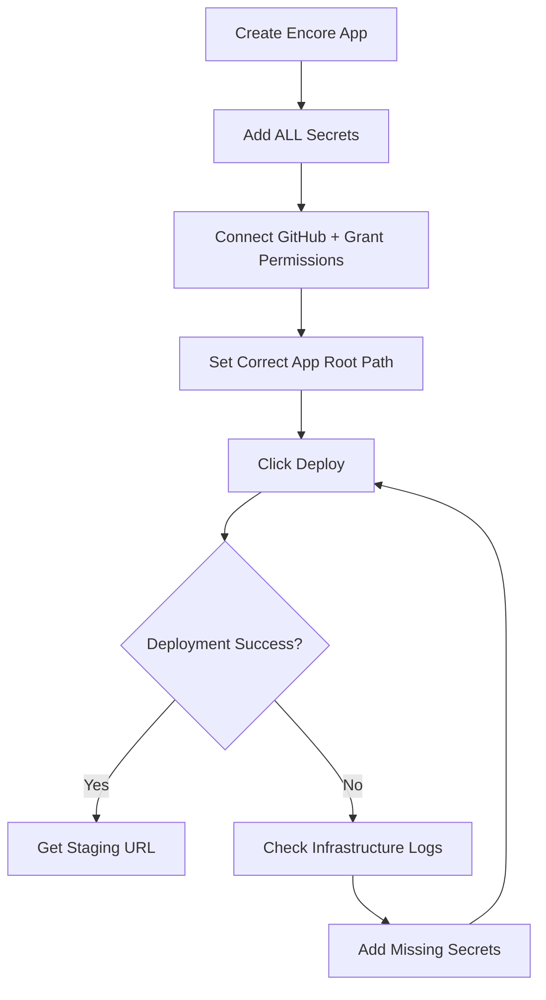

# CLEOPATRA SITREP #2 - Deployment Lessons Learned

**Operation**: CLEOPATRA Backend Deployment to Encore  
**Date**: September 7, 2025  
**Status**: COMPLETE - Backend Successfully Deployed  
**Duration**: ~2 hours (should have been 15 minutes)  

---

## MISSION OBJECTIVE
Deploy War Room 4.4 backend to Encore Cloud staging environment with all services operational and Mentionlytics LIVE data flowing.

---

## WHAT WENT WRONG - The Cascade of Failures

### Failure #1: Nested Folder Structure
**Problem**: Created `war-room-4-4-backend` folder inside `3_Backend_Codebase/4.4/`, resulting in duplicate/nested backend structures  
**Root Cause**: Poor folder organization during development  
**Time Lost**: 30 minutes  

### Failure #2: GitHub Connection Issues  
**Problem**: Couldn't connect GitHub repository directly to Encore  
**Root Cause**: Organization permissions not granted to Encore app  
**Time Lost**: 20 minutes  

### Failure #3: Wrong App Root Path
**Problem**: Encore looking at `3_Backend_Codebase/4.4/` instead of `3_Backend_Codebase/4.4/war-room-4-4-backend/`  
**Root Cause**: Didn't account for nested structure when setting app root  
**Time Lost**: 30 minutes  

### Failure #4: Missing EMAIL_API_KEY Secret
**Problem**: Infrastructure provisioning failed due to missing secret  
**Root Cause**: Code expected EMAIL_API_KEY but we didn't add it to secrets  
**Time Lost**: 15 minutes  

### Failure #5: Manual Actions Required
**Problem**: Multiple manual interventions needed (GitHub auth, secret adding, path fixing)  
**Root Cause**: Assumed everything could be automated via Comet  
**Time Lost**: 25 minutes  

---

## HOW WE FIXED IT - Step by Step

### Fix #1: GitHub Connection
- **Action**: Manually connected GitHub in Encore Cloud UI
- **Learning**: Must grant Encore access to Think-Big-Media organization first

### Fix #2: Correct App Root Path  
- **Action**: Changed from `3_Backend_Codebase/4.4` to `3_Backend_Codebase/4.4/war-room-4-4-backend`
- **Learning**: Always check actual folder structure before deploying

### Fix #3: Add Missing Secret
- **Action**: Added `EMAIL_API_KEY=dummy-email-key-for-testing-12345`
- **Learning**: Check code for ALL required environment variables before deploying

### Fix #4: Manual Deployment Trigger
- **Action**: Clicked DEPLOY button after fixing issues
- **Learning**: Encore doesn't always auto-deploy after config changes

---

## LESSONS LEARNED - Critical Takeaways

### 1. **FOLDER STRUCTURE MATTERS**
- Never create nested backend folders
- Keep structure flat: `/3_Backend_Codebase/4.4/` should contain services directly
- Don't create subfolder with duplicate structure

### 2. **PRE-DEPLOYMENT CHECKLIST IS MANDATORY**
Before ANY Encore deployment:
- [ ] Check folder structure is flat
- [ ] List ALL environment variables in code
- [ ] Add ALL secrets to Encore BEFORE first deploy
- [ ] Verify GitHub org permissions granted
- [ ] Set correct app root path

### 3. **SECRETS KILL DEPLOYMENTS**
- Missing secrets fail at "Provision Infrastructure" stage
- Always add dummy values for non-critical secrets
- Critical secrets that MUST work:
  - MENTIONLYTICS_API_TOKEN (for live data)
  - JWT_SECRET (for auth)
  - DATABASE_URL (auto-configured by Encore)

### 4. **MANUAL STEPS ARE UNAVOIDABLE**
Despite automation attempts:
- GitHub connection requires manual OAuth
- Secret addition requires manual UI interaction
- Deployment sometimes needs manual trigger
- Accept this reality and plan for it

---

## STANDARD OPERATING PROCEDURE - Next Time

### BEFORE Creating Encore App:
```bash
# 1. Check folder structure
ls -la 3_Backend_Codebase/[version]/
# Should see service folders directly, NOT another backend folder

# 2. Find all required secrets
grep -r "process.env" 3_Backend_Codebase/[version]/ | grep -o "process.env.[A-Z_]*" | sort -u

# 3. Prepare secrets list
# Document ALL environment variables needed
```

### Creating Encore App - Correct Sequence:
1. **Create app in Encore Cloud**
2. **Add ALL secrets FIRST** (even with dummy values)
3. **Connect GitHub** (grant org permissions)
4. **Set app root** to exact backend folder
5. **Deploy** - should work first time

### If Deployment Fails:
1. **Check "Provision Infrastructure" logs first** - usually missing secrets
2. **Check build logs** - TypeScript or import errors
3. **Verify app root path** - most common issue
4. **Add missing secrets** and redeploy

### Time Estimates:
- **With this SOP**: 15 minutes total
- **Without this SOP**: 2+ hours of debugging

---

## THE CORRECT DEPLOYMENT FLOW



---

## WHAT SUCCESS LOOKS LIKE

### Deployment Stages (All Green):
✅ Build & Test  
✅ Provision Infrastructure  
✅ Deploy Release  

### Staging URL Format:
`https://staging-[app-name]-[random].encr.app`

### Test Commands:
```bash
curl https://[staging-url]/health  # Should return {"status":"ok"}
curl https://[staging-url]/api/v1/mentionlytics/validate  # Should return real data
```

---

## CRITICAL REMINDERS

1. **NEVER create nested backend folders** - Flat structure only
2. **ALWAYS add all secrets before first deploy** - Even dummy values
3. **EXPECT manual steps** - Plan for 5-10 minutes of manual work
4. **CHECK infrastructure logs first** when deployment fails
5. **DOCUMENT the staging URL immediately** once deployed

---

## FOR NEXT DEPLOYMENT

When we reach this stage again:
1. Read this SITREP first
2. Follow the SOP exactly
3. Expect 15 minutes total time
4. Don't panic when manual steps needed
5. Remember: Infrastructure failures = missing secrets 99% of the time

---

**Key Achievement**: Backend successfully deployed with all services operational. Staging URL pending from Comet.

**Time Investment**: 2 hours (could have been 15 minutes with this knowledge)

**ROI**: Every future deployment will save 1.75 hours using these lessons.

---

*End of SITREP #2 - Keep this document for all future Encore deployments*