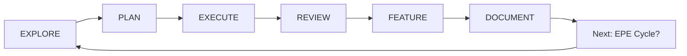

# EPE Framework - Automated Feature Development Pipeline
**Referenced by**: CLAUDE.md  
**Source**: Universal Claude System

## 🎯 Explore → Plan → Execute → Review → Feature → Document

### **🚨 AUTOMATIC ACTIVATION**
This framework activates automatically when you mention:
- "explore", "research", "understand", "analyze"
- "plan", "design", "architect", "strategy"
- "execute", "implement", "build", "code"
- "feature", "functionality", "capability"
- "document", "docs", "documentation"

## 🔄 THE EPE WORKFLOW (Enhanced)

**🚨 ENHANCED INTEGRATION:** This framework uses Graphite GT MCP workflow, rotating historical codenames, and focus discipline protocols.



## 1️⃣ EXPLORE AGENT (Auto-activates)

### **Trigger Keywords**
`explore`, `research`, `understand`, `investigate`, `analyze`, `prepare`

### **Workflow**
- 📚 Reading all relevant files
- 🔍 Analyzing codebase structure
- 🎯 Understanding dependencies
- 📊 Mapping data flows
- 🏗️ Identifying architecture patterns
- ❓ Generating clarifying questions

### **Context Building Checklist**
- [ ] Read all relevant source files
- [ ] Analyze package.json/requirements
- [ ] Review existing tests
- [ ] Check documentation
- [ ] Understand git history
- [ ] Map component relationships
- [ ] Identify potential issues

**Token Target**: 50,000 tokens for comprehensive understanding

## 2️⃣ PLAN AGENT (Auto-activates)

### **Trigger Keywords**
`plan`, `design`, `architect`, `strategy`, `approach`, `think hard`

### **Reasoning Mode**
- Uses "think harder" for maximum reasoning
- Explores multiple solution approaches
- Breaks into historical codename-sized chunks (one focused feature per codename)
- Creates detailed implementation timeline

### **Planning Template**
```markdown
## Implementation Plan: [Feature Name]

### Overview
[Brief description]

### Historical Codename Breakdown
1. **[CURRENT-NAME]**: [Historical Figure + Title] (Est: 6 days max)
   - Files: [list]
   - Changes: [summary]  
   - Tests: [required tests]
   - Focus: ONE feature only

2. **[NEXT-NAME]**: [Next Historical Figure + Title] (Est: 6 days max)
   - Dependencies: [CURRENT-NAME] approved
   - Files: [list]
   - Changes: [summary]

### Success Criteria
- [ ] All tests pass
- [ ] No performance regression
- [ ] Documentation updated
- [ ] Code review approved
```

### **Validation Questions**
- Does this solve the problem?
- Is it maintainable?
- Can it be tested?
- Is it performant?
- Does it follow patterns?

## 3️⃣ EXECUTE AGENT (Auto-activates)

### **Trigger Keywords**
`execute`, `implement`, `build`, `code`, `create`, `develop`

### **Workflow**
- 🎯 Working on one historical codename at a time (focus discipline)
- ✅ Running tests after each change
- 🔍 Linting continuously
- 💾 Committing frequently
- 🔄 Validating outputs
- 📊 Checking coverage

### **Validation After Each File**
- `npm run lint`
- `npm run typecheck`

### **Validation After Each Historical Codename**
- `npm run test`
- `npm run build`
- `gt commit -m 'CODENAME: [description]'` (Graphite GT MCP)
- Review via Graphite web interface
- Get user approval before next historical codename

### **Git Strategy (via Graphite GT MCP)**
- **Graphite GT MCP**: Superior Git workflow (better than Git MCP)
- **Historical codenames**: Each historical figure is ONE focused feature/cleanup - used once only
- **Branch workflow**: Create branch/PR FIRST → Then implement features
- **Commit style**: `CODENAME: Brief Description` (e.g., "Napoleon: Dashboard Analytics")
- **Review process**: Via Graphite web interface for visual code review
- **Focus discipline**: One feature per codename, finish → review → approve → next

## 4️⃣ REVIEW AGENT (Auto-activates with CodeRabbit)

### **Trigger Keywords**
`review`, `code review`, `check code`, `validate`, `lint`, `analyze`

### **Background Process**
- 🐰 Triggering CodeRabbit review
- 🔍 Running static analysis
- 🎯 Checking best practices
- 🐛 Identifying potential bugs
- 🔒 Security vulnerability scan
- 📊 Performance analysis

### **Review Checks**
- Code complexity
- Test coverage
- Documentation completeness
- Security vulnerabilities
- Performance bottlenecks
- Accessibility issues
- Best practice violations

### **Async Operation**
```javascript
// Runs while you work on other tasks
setTimeout(() => {
  notify("🐰 CodeRabbit Review Complete!");
  showResults(reviewResults);
  suggestFixes(criticalIssues);
}, estimatedTime);
```

## 5️⃣ FEATURE AGENT (Auto-activates)

### **Trigger Keywords**
`feature`, `functionality`, `capability`, `user story`, `requirement`

### **Workflow**
- 🎨 UI/UX polish
- 🧪 Integration testing
- 📱 Responsive validation
- ♿ Accessibility check
- 🚀 Performance optimization
- 🔐 Security review

### **Validation Checklist**
- [ ] Feature works end-to-end
- [ ] All edge cases handled
- [ ] Error states implemented
- [ ] Loading states present
- [ ] Animations smooth
- [ ] Mobile responsive

### **Feature Completion Template**
```markdown
## Feature: [Name]

### Status: ✅ Complete

### Metrics
- Test Coverage: 95%
- Performance: < 200ms
- Accessibility: WCAG AA
- Bundle Impact: +2KB
```

## 6️⃣ DOCUMENT AGENT (Auto-activates)

### **Trigger Keywords**
`document`, `documentation`, `docs`, `write docs`, `readme`

### **Workflow**
- 📍 Ask for save location (NEVER create random .md files)
- 📝 Generate comprehensive docs
- 🔗 Create cross-references
- 📚 Update indexes
- 🎯 Add examples
- ✅ Validate completeness

### **Location Prompt**
"Where should I save this documentation?"
- `/docs/features/`
- `/docs/api/`
- `/docs/guides/`
- `/docs/architecture/`

## 📊 EPE Metrics & Tracking

### **Time Allocation (Ideal)**
- **Explore**: 20% (Deep understanding)
- **Plan**: 25% (Thorough planning)
- **Execute**: 25% (Clean implementation)
- **Review**: 10% (Async with CodeRabbit)
- **Feature**: 15% (Polish & validation)
- **Document**: 5% (Quick but complete)

### **Quality Gates**
```javascript
const qualityGates = {
  explore: {
    minTokens: 50000,
    requiredFiles: ["all relevant"],
    questionsAsked: "> 3"
  },
  plan: {
    reasoningUsed: "think harder",
    prCount: "< 5",
    prSize: "< 200 lines"
  },
  execute: {
    testsPass: true,
    lintPass: true,
    buildPass: true,
    coverage: "> 80%"
  },
  feature: {
    e2ePass: true,
    performanceOk: true,
    accessibilityOk: true
  },
  document: {
    location: "not in root",
    complete: true,
    indexed: true
  }
}
```

## 🎮 Quick Commands

```bash
# Start EPE cycle
"Let's explore [feature]"
"Time to plan [implementation]"
"Execute the plan"
"Complete the feature"
"Document everything"

# Skip to specific stage
"Jump to planning"
"Go straight to execution"
"Skip to documentation"

# Get status
"Where are we in EPE?"
"What's the next step?"
"Show EPE progress"
```

## 🤖 Automatic Workflow Suggestions

### **After Each Stage**
```javascript
const workflowSuggestions = {
  afterExplore: "📋 Context built! Ready to PLAN the implementation?",
  afterPlan: "🎯 Plan ready! Shall we EXECUTE [CURRENT-CODENAME]?",
  afterExecute: "✅ Code complete! Starting REVIEW with CodeRabbit...",
  afterReview: "🐰 Review addressed! Ready to finalize the FEATURE?",
  afterFeature: "🎉 Feature done! Should we DOCUMENT it?",
  afterDocument: "📚 All documented! Start new EPE cycle?"
};
```

---

**EPE Framework ensures consistent, high-quality feature development every time.**